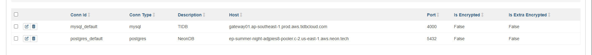
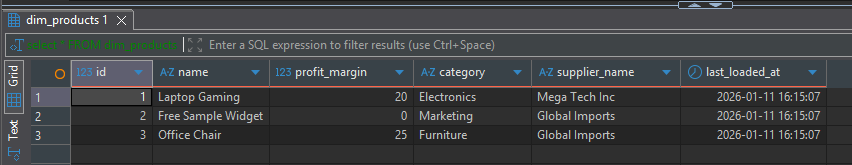
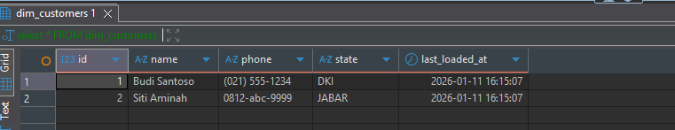
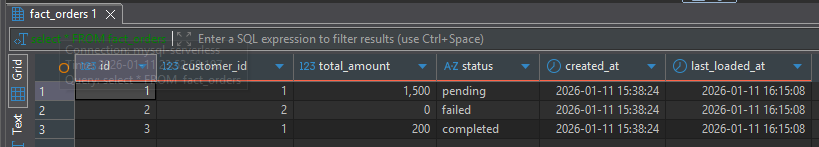

# Assignment day 30 - Airflow

## Handika 

### How to setup
1. exec sql files to PG and Mysql db -> `.\src\sql scripts`
2. configure connection to airflow `mysql_default` and `postgres_default`
3. run DAG

### Necessary screenshot
1. connection

2. running test

3. dim_product

4. dim_customer

5. fact_orders
